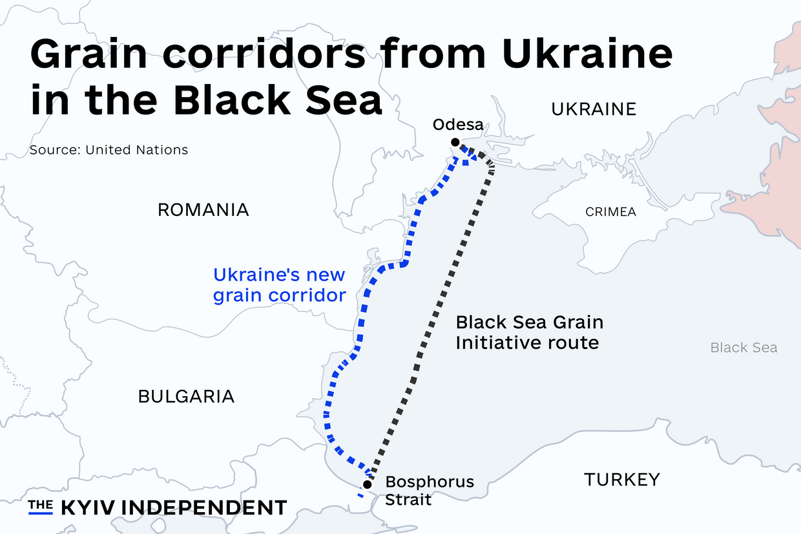
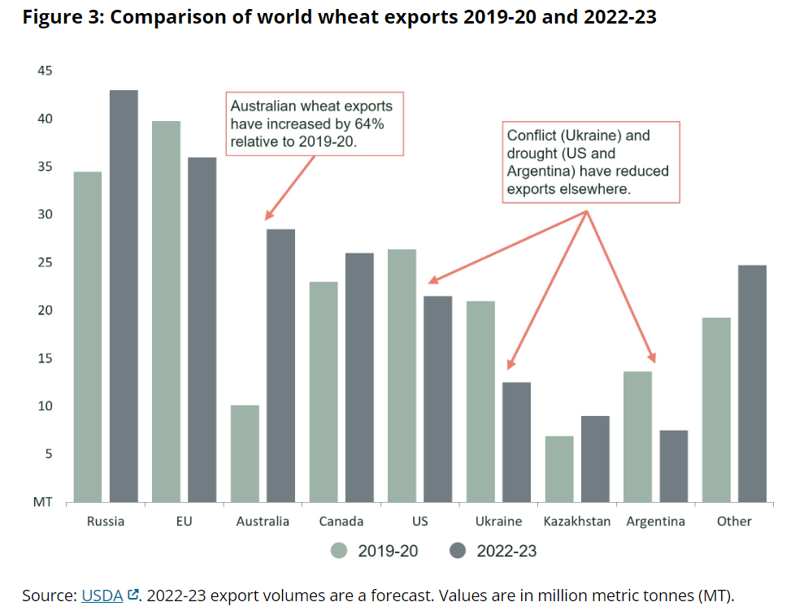
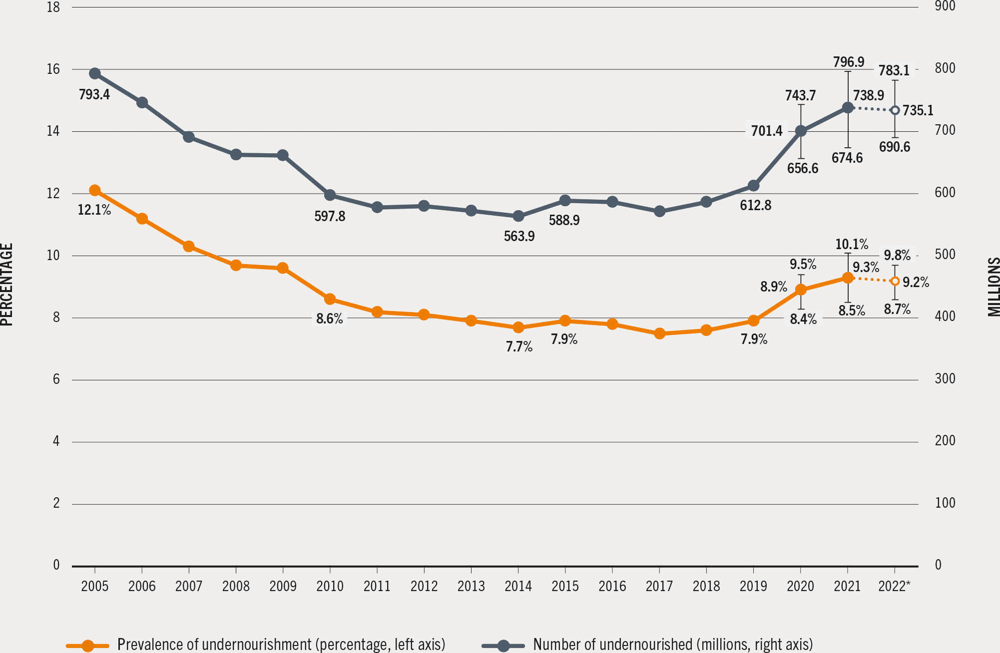
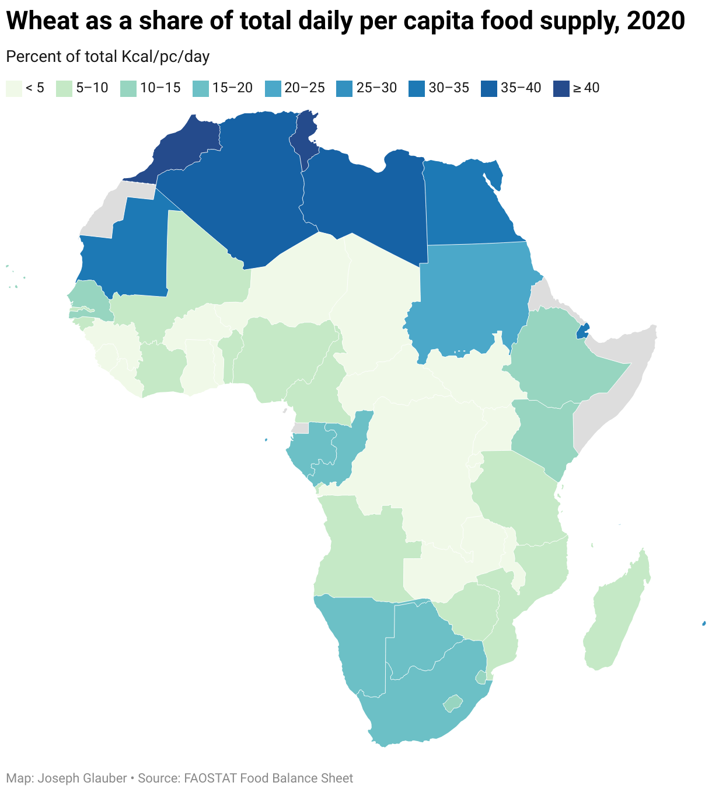
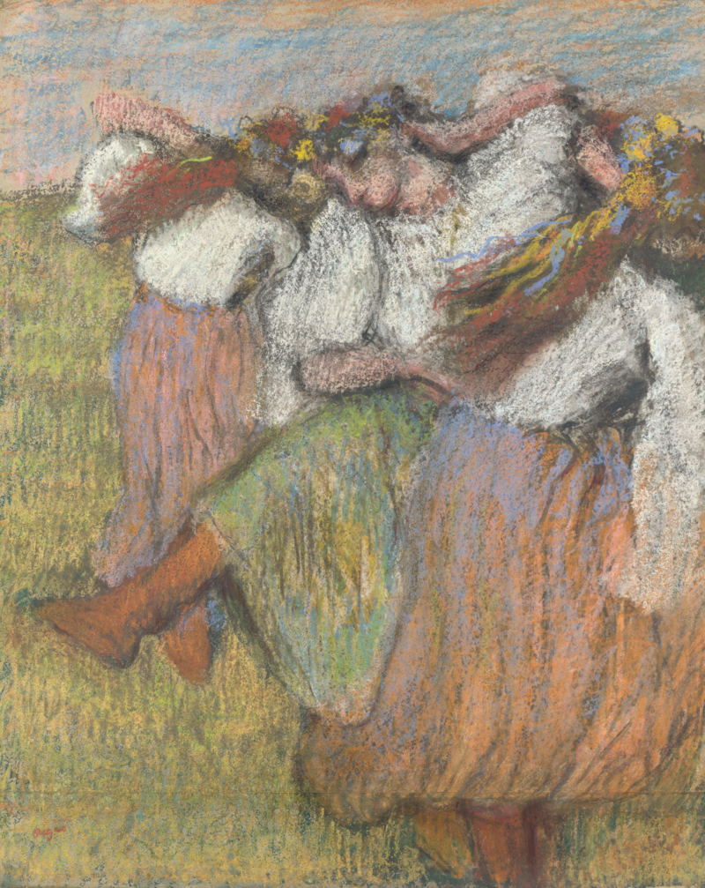

Name: Christian “Titi” Morgan
Class: GEO 102
Date: 13 December 2023

World Geography Final Exam Paper © 2023 by Christian Morgan is licensed under CC BY-NC-SA 4.0. To view a copy of this license, visit http://creativecommons.org/licenses/by-nc-sa/4.0/

**Russian Control of the Black Sea Disrupts the Wheat Supply Chain**

  On February 24, 2022, Russia launched a full-scale invasion of Ukraine (Ray, 2023). The invasion escalated the Russia-Ukraine War, which began in 2014 with the Russian occupation of the Republic of Crimea and a separatist insurgency in eastern Ukraine. In Ukraine and Southern Russia, forests transition into “steppe environments dominated by grasslands and by [chernozem soil]” (Price, 2019), perfect for grain, specifically wheat. Ukraine and Russia are responsible for 12% and 17% of the world’s wheat exports, respectively (Lin et al., 2023), and wheat provides around 20% of the world's calories for human consumption (Guiterrez, 2017). Countries such as Somalia and Egypt depend upon Eurasian wheat imports. In July 2023, Russia opted out of a deal brokered by the United Nations to allow Ukraine to export commercial food and fertilizer from the Black Sea (n.d., United Nations). The collapse of the Black Sea Grain Initiative (BSGI) is disruptive because it has pressured other wheat exporters to increase their supply and increased food insecurity in regions like North Africa.
 
 **Figure 1: Grain corridors from Ukraine in the Black Sea (Source: The Kyiv Independent)**
 

**Figure 2: Comparison of world wheat exports 2019-20 and 2022-23 (Source: USDA)**

  By rail, truck, or barge, Ukraine continues to ship grain West (Grain: World Markets and Trade, 2022). Ukraine has also experimented with an alternative Black Sea interim corridor (Figure 1, see above). Despite the continuance of Ukrainian grain exports, the overall decrease will shift the global wheat supply. Globalization is the increasing interconnectedness of people and places worldwide, which has been enabled by shipping, communication, financial, and other technologies. Food being traded across a global network has given countries an opportunity to import food when domestic production is low, seasonally or sporadically. The global food trade market becomes problematic when a country is dependent upon imports or monopolies exist. (Raj, 2022) Ukrainian wheat must route through sea mines and warplanes. Its ports, Chornomorsk, Odesa and Pivdennyi, have been attacked by Russian bombs (AP, 2023). On-land attacks on farmers may have a more significant impact on wheat exports than the Russian control of the Black Sea. Ukrainian farmers must rebuild their bombed homes and dig up land mines before seeds can be planted. Countries will need to increase their wheat crop or find new trade partners to offset the loss of Ukrainian exports if the war continues. For example, according to Figure 2 (see above), Australia was forecasted to increase its wheat exports by 63% from 2019-20 to 2022-23. This may compensate for the decrease in the global wheat supply due to the decrease of exports by largely Ukraine, in addition to the decrease in exports from the US and Argentina due to drought. 

**Figure 3:  GLOBAL HUNGER REMAINED VIRTUALLY UNCHANGED FROM 2021 TO 2022 BUT IS STILL FAR ABOVE PRE-COVID-19-PANDEMIC LEVELS (Source: FAO. 2023. FAOSTAT: Suite of Food Security Indicators. In: FAO. [Cited 12 July 2023]. www.fao.org/faostat/en/#data/FS)**

In a blog post, agricultural economist Aaron David Smith argues that we cannot go back in time and plant a wheat crop for what was lost to t)e Russia-Ukraine War. This was in response to policy suggestions for the US to increase its yields altruistically and provide more wheat globally. There has been concern that the Russia-Ukraine War has caused increases in global hunger. The Food and Agriculture Organization of the United Nations (FAO) monitors global hunger using the Prevalence of Undernourishment (PoU) indicator. The PoU indicator factors a country’s population, dietary energy needs in kilocalories per person per day, and food availability. From Figure 3 (see above), one can observe the Russia-Ukraine War as an event that has occurred along an upward trend of PoU since 2019, the start of the COVID-19 pandemic. The FAO does note that Africa experiences a disproportionate amount of PoU to the rest of the world. This suggests that while Russia-Ukraine is not responsible for a global hunger crisis, it can be evaluated for causing a regional hunger crisis. 

**Figure 4: Wheat as a share of total daily per capita food supply, 2020 (Source: ifpri.org)**

  July 2023, Putin promised a pittance to Burkina Faso, Zimbabwe, Mali, Somalia, Eritrea and Central African Republic at the Russia-Africa Summit. For the following 3-4 months, the countries listed would receive 50,000 tons of grain. That number is remarkably less than the 725,000 tons of grain once shipped by the UN for the BSGI (Anna, 2023). The expiration of the BSGI gives stage time to the Eurasian Economic Union in the international theatre. Russia now presents itself as the leader of an alternative economy rather than an ally in an international trade agreement. Due to the dry climate of the Sahel, many regions in North Africa are not suitable for agriculture, and therefore, North African countries must rely on imports. North African countries rely on wheat, an import once provided by the BSGI, for a high percentage of their daily caloric intake. According to Figure 4 (see above), in 2020, 25-30% of Egypt’s caloric intake was derived from wheat. Geographically, Russia expanded its control to the Black Sea and the Crimean peninsula. Turkey controls the Bosphorus Strait, a chokepoint between the Black and Mediterranean Seas. Ukraine’s port infrastructure is compromised and it must utilize on-land trade routes to the European Union. Ukrainian wheat cannot travel through the strait, Mediterranean, and Suez Canal to Egypt like was once usual,

**Figure 5: Ukrainian Dancers by Edgar Degas circa 1899 (Source: Wikimedia)**

  Edgar Degas, in 1899, created a pastel drawing of some dancers. Recently, museums across the world have revised the art’s title from “Russian Dancers” to” Ukrainian Dancers'' for accuracy (Quinn, 2023), returning cultural heritage to its rightful inheritors. The border between Ukraine and Russia is not a matter of perspective. The dancers in the pastel drawing wear yellow and blue ribbons, colors of Ukraine. Russia using force to reclaim Soviet Union-era territory is an infringement of the sovereignty of Ukraine and other European countries. 

  In conclusion, the data needed to understand the impact of the collapse of BSGI needs to be improved. Russia does not consistently report honest numbers about its exports (Glauber, 2023). The USDA forecasts a 27% decrease in Ukrainian grain exports this year compared to last due to limited seaborne capacity (Grain: World Markets and Trade, 2022), but what percentage of exports are lost due to declining farmland? Hunger is correlated to but not caused by a decrease in exports. For example, the amount of arable land or tons of wheat produced does not determine a country’s undernourishment levels as the country’s centrality in the global wheat supply chain network (Ray, 2022). Centrality refers to the country’s access to trade routes, which changes in geopolitical conflict. Egypt is an example of a country with low centrality.  
Measuring the impact of the collapse of the BSGI in metric tons and calories of wheat, and ultimately PoU, is the work of a historian. Like how the accurate title of Degas’ drawing helps the Ukrainians remember themselves, calculating the impact of the BSGI on global wheat supply and food insecurity in North Africa will help us remember Russia as the war continues or changes. Numbers paint a picture.

**References:**

Anna, C. (2023, July 30). African leaders leave Russia summit without grain deal or a path to end the war in Ukraine. AP News. https://apnews.com/article/russia-africa-summit-ukraine-grain-war-125d5a6d5052f4221c46be52c1618cf7’

Associated Press. (2023, September 17). First civilian cargo ships arrive in Ukraine port since Russia’s withdrawal from grain deal. PBS NewsHour. https://www.pbs.org/newshour/world/first-civilian-cargo-ships-arrive-in-ukraine-port-since-russias-withdrawal-from-grain-deal

Quinn, B. (2022, April 3). National Gallery renames Degas’ Russian Dancers as Ukrainian Dancers. The Guardian. https://www.theguardian.com/artanddesign/2022/apr/03/national-gallery-renames-degas-russian-dancers-as-ukrainian-dancers

FAO. (2023). The State of Food Security and Nutrition in the World 2023. https://doi.org/10.4060/cc3017en

Grain: World Markets and Trade. (2022). https://downloads.usda.library.cornell.edu/usda-esmis/files/zs25x844t/n296zh705/4f16dn46k/grain.pdf
Glauber, J., Kim, S., Olivetti, E., & Vos, R. (2023). End of the Black Sea Grain Initiative: Implications for sub-Saharan Africa. Ifpri.org. https://www.ifpri.org/blog/end-black-sea-grain-initiative-implications-sub-saharan-africa#:~:text=Importance%20of%20wheat%20exports%20to%20sub%2DSaharan%20Africa&text=Most%20of%20these%20countries%20depend

Gutierrez L (2017). Impacts of El Niño-Southern Oscillation on the wheat market: A global dynamic analysis. PLoS ONE 12(6): e0179086. https://doi.org/10.1371/journal.pone.0179086
Lin, Faqin., Li, Xuecao., Jia, Ningyuan., Feng, Fan., Huang, Hai., Huang, Jianxi., Fan, Shenggen., Ciais, Philippe., Song, X.-P.. (2023). The impact of the Russia-Ukraine conflict on global food security. Elsevier.

Price, M., Rowntree, L., Lewis, M., & Wyckoff, W. (2019). Globalization and Diversity (6th ed.). Pearson Education (US). https://online.vitalsource.com/books/9780135198896
Raj, Subhashni; Brinkley, Catherine; and Ulimwengu, John M. 2022. Connected and extracted: 

Understanding how centrality in the global wheat supply chain affects global hunger using a network approach. PLoS ONE 17(6): e0269891. https://doi.org/10.1371/journal.pone.0269891
Ray, M. (2023, November 30). Russia-Ukraine War. Encyclopedia Britannica. https://www.britannica.com/event/2022-Russian-invasion-of-Ukraine

Smith, A. D. (2022, May 18). Was I Wrong About the Global Food Crisis and Inflation? | Aaron Smith. Asmith.ucdavis.edu. https://asmith.ucdavis.edu/news/beware-balancer-trap
‌(n.d.). Beacon on the Black Sea. United Nations. Retrieved November 30, 2023, from https://www.un.org/en/black-sea-grain-initiative

